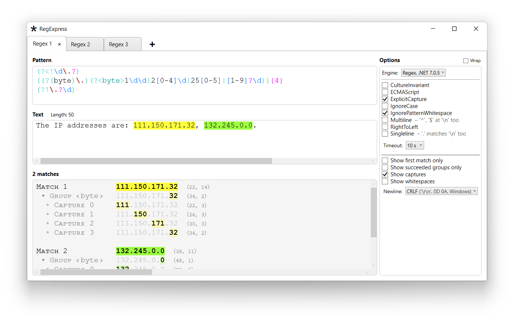
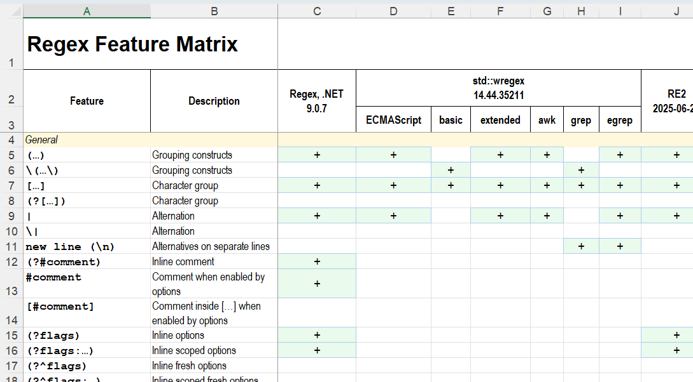

# RegExpress

A tester for researching Regular Expression engines. Made in Visual Studio 2026 using C#, C++, WPF, .NET 9.
The comparison of the engines is shown in an Excel file.

It includes the following Regular Expression engines:

* [**Regex**](https://learn.microsoft.com/en-us/dotnet/api/system.text.regularexpressions.regex?view=net-9.0) class from .NET 9.
* [**Regex**](https://learn.microsoft.com/en-us/dotnet/api/system.text.regularexpressions.regex?view=netframework-4.8) class from .NET Framework 4.8.
* [**wregex**](https://docs.microsoft.com/en-us/cpp/standard-library/regex) class in C++:
  * Standard Template Library, MSVC, 
  * Standard Template Library, GCC,
  * [_SRELL_](https://www.akenotsuki.com/misc/srell/en/) 2026.05.
* [**Boost.Regex**](https://www.boost.org/doc/libs/1_89_0/libs/regex/doc/html/index.html) from Boost C++ Libraries 1.89.0.
* [**PCRE2**](https://github.com/PCRE2Project/pcre2) Open Source Regex Library 10.47 (in C).
* [**RE2**](https://github.com/google/re2) Library 2025-08-12 from Google (in C++).
* [**Oniguruma**](https://github.com/kkos/oniguruma) Regular Expression Library 6.9.10 (in C++).
* [**SubReg**](https://github.com/mattbucknall/subreg) 2024-08-11 (in C).
* **JavaScript** [**RegExp**](https://developer.mozilla.org/en-US/docs/Web/JavaScript/Reference/Global_Objects/RegExp)
  * Microsoft Edge [_WebView2_](https://docs.microsoft.com/en-us/microsoft-edge/webview2/), 
  * _V8_ \(via [Node.js](https://nodejs.org)\) 14.1.146,
  * [_QuickJs_](https://bellard.org/quickjs/) 2026-06-04,
  * [_SpiderMonkey_](https://spidermonkey.dev/) C145.0,
  * _JavaScriptCore_ (via [Bun 1.3.13](https://bun.sh/)[^1]),
  * [_RE2JS_](https://github.com/le0pard/re2js) 2.8.3,
  * [_Regex+_](https://github.com/slevithan/regex) 6.1.0.
* **VBScript** [**RegExp**](https://learn.microsoft.com/en-us/previous-versions/yab2dx62(v=vs.85)) object used in Publisher, Word, Excel, Access.
* [**Hyperscan**](https://github.com/intel/hyperscan) 5.4.2 from Intel (in C).
* [**Chimera**](http://intel.github.io/hyperscan/dev-reference/chimera.html), a hybrid of Hyperscan and PCRE 8.41 (in C).
* [**ICU Regular Expressions**](https://icu.unicode.org/) 77.1 (in C++).
* **Rust** 1.95.0 crates:
  * [_regex_](https://docs.rs/regex) 1.12.3,
  * [_regex\_lite_](https://docs.rs/regex_lite) 0.1.9,
  * [_fancy\_regex_](https://docs.rs/fancy-regex) 0.18.0, 
  * [_regress_](https://docs.rs/regress) 0.11.1,
  * [_resharp_](https://github.com/ieviev/resharp) 0.6.11.
  * [_anre_](https://github.com/hemashushu/anre) 2.1.1.
* [**Java**](https://docs.oracle.com/en/java/javase/26/docs/api/java.base/java/util/regex/package-summary.html) 26.0.1 (*java.util.regex* and *com.google.re2j* packages).
* [**Python**](https://www.python.org/) 3.13.6 modules:
  * _re_,
  * [_regex_](https://pypi.org/project/regex) 2026.5.9.
* [**D**](https://dlang.org/phobos/std_regex.html) 2.112.0 (*std.regex* module).
* [**Perl**](https://perldoc.perl.org/perlreref) 5.40.2 (Strawberry Perl).
* **Fortran** [**Forgex**](https://github.com/ShinobuAmasaki/forgex) v4.6 module (Intel® Fortran Compiler 2026.0.0).
* [**TRE**](https://github.com/laurikari/tre) 0.9.0 (in C).
* [**tiny-regex-c**](https://github.com/rurban/tiny-regex-c) 2022-06-21 (in C).
* **Ada GNAT.Regpat** 15.2.0.
* [**TRegEx**](https://docwiki.embarcadero.com/Libraries/Florence/en/System.RegularExpressions) 29.0 (C++Builder, Delphi).
* [**QRegularExpression**](https://doc.qt.io/qt-6/qregularexpression.html) class (based on PCRE2) from Qt 6.9.3 (in C++).
* [**compile-time-regular-expressions (CTRE)**](https://github.com/hanickadot/compile-time-regular-expressions)[^2] 3.11.0  (in C++).
* **GRETA** 2.6.4 (in C++).
* **Zig** 0.16.0 libraries:
  * [_zig-regex_](https://github.com/zig-utils/zig-regex) v0.2.0, 
  * [_mvzr_](https://github.com/mnemnion/mvzr) v0.3.12
  * _PZRE_ v0.2.2.
* [**RE#**](https://github.com/ieviev/resharp-dotnet) 1.0.3 (for F#, C#, VB).
* **Go** 1.26.4 packages:
  * [_regexp_](https://pkg.go.dev/regexp) 1.26.4,
  * [_regexp2_](https://pkg.go.dev/github.com/dlclark/regexp2/v2) 2.2.2,
  * [_rexa_](https://pkg.go.dev/github.com/himclix/rexa) 0.1.0,
  * [_coregex_](https://pkg.go.dev/github.com/coregx/coregex) 0.12.22.

 

Sample:

#### Usage

Enter the pattern and text to textboxes. The results are updated automatically. The found matches are colourised.

Use the **Options** area to select and configure the Regular Expression engine.

Press the “➕” button to open more tabs. 

Currently the regular expressions are saved and loaded automatically.

The program can be built using Visual Studio 2026 (recommended) or Visual Studio 2022. The following Visual Studio workloads are required:

* .NET desktop development.
* Desktop development with C++.

Open the **RegExpressWPFNET.slnx** solution. Right-click the **RegExpressWPFNET** project in Solution Explorer
and select “Set as Startup Project”. Select “Rebuild Solution” from BUILD menu. Then the program can be started.

> [!NOTE]
> To build the solution in Visual Studio 2022, the Platform Toolset option for C++ projects can be changed 
from **v145** to **v143**.

The sources are written in C# and C++. The minimal sources of third-party regular expression libraries are included.

#### Details

* Principal GIT branch: **main**.
* Solution file: **RegExpressWPFNET.slnx**.
* Startup project: **RegExpressWPFNET**.
* Configurations: **“Debug, Any CPU”** or **“Release, Any CPU”**. The C++ projects use **“x64”**.
* Operating Systems: **Windows 11**, **Windows 10**.

Some of engines require certain third-party library files, which were downloaded or compiled separately 
and included into **main** branch. (No additional installations required).

> [!NOTE]
> After loading the solution file in Visual Studio, make sure that 
> the **RegExpressWPFNET** project is set as Startup Project.

> [!NOTE]
> To avoid compilation errors after acquiring new releases, use the “Rebuild Solution” command 
instead of “Build Solution”.

 

## Feature Matrix

The various functionalities of regular expression engines are presented in the Excel file.

Download and open the file:

* [RegexFeatureMatrix.xlsx](RegexFeatureMatrix.xlsx)

#### Example of several essential indicators:

* which engines support named groups (`(?<name>...)` or `(?P<name>...)`)?
* which engines support variable-length positive and negative lookbehinds (`(?<=...` and `(?<!...)`)?
* which engines are protected against “catastrophic backtracking (ReDoS)” (pattern: `(a*)*b`, text: `aaaaaaaaaaaaaaaaaaaaaaaaaaaaaaaaaaaaac`)?
* which engines support fuzzy or approximate matching?

The answers are in the Excel file.

## Betterments

There is a notable advancement from several perspectives:

* [https://github.com/mitchcapper/RegExpress](https://github.com/mitchcapper/RegExpress)

[^1]: The **Bun** engine requires a modern 64-bit processor.
[^2]: The **CTRE** engine is available in selected environments only.

 
 
