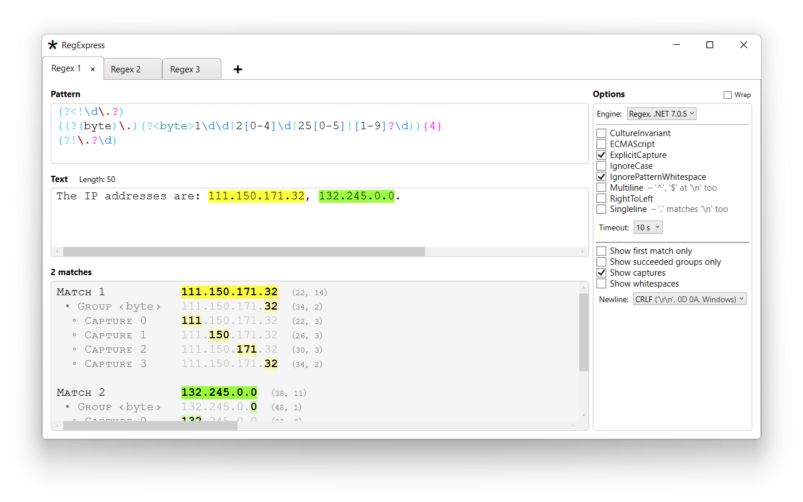

# RegExpress

A tester for researching Regular Expression engines. Made in Visual Studio 2022 using C#, C++, WPF, .NET 9.

It includes the following Regular Expression engines:

* **[Regex](https://learn.microsoft.com/en-us/dotnet/api/system.text.regularexpressions.regex?view=net-9.0)** class from .NET 9.
* **[Regex](https://learn.microsoft.com/en-us/dotnet/api/system.text.regularexpressions.regex?view=netframework-4.8)** class from .NET Framework 4.8.
* **[wregex](https://docs.microsoft.com/en-us/cpp/standard-library/regex)** class from C++ Standard Template Library (MSVC) and GCC.
* **[Boost.Regex](https://www.boost.org/doc/libs/1_89_0/libs/regex/doc/html/index.html)** from Boost C++ Libraries 1.89.0.
* **[PCRE2](https://pcre.org/)** Open Source Regex Library 10.46 (in C).
* **[RE2](https://github.com/google/re2)** Library 2025-08-12 from Google (in C++).
* **[Oniguruma](https://github.com/kkos/oniguruma)** Regular Expression Library 6.9.10 (in C++).
* **[SubReg](https://github.com/mattbucknall/subreg)** 2024-08-11 (in C).
* **JavaScript [RegExp](https://developer.mozilla.org/en-US/docs/Web/JavaScript/Reference/Global_Objects/RegExp)** object
  in Microsoft Edge [WebView2](https://docs.microsoft.com/en-us/microsoft-edge/webview2/), 
  V8 \(via [Node.js](https://nodejs.org)\) 13.6.233.10,
  [QuickJs](https://bellard.org/quickjs/) 2025-04-26,
  [SpiderMonkey](https://spidermonkey.dev/) C143.0
  and JavaScriptCore (via [Bun 1.2.21](https://bun.sh/)).
* **VBScript [RegExp](https://learn.microsoft.com/en-us/previous-versions/yab2dx62(v=vs.85))** object used in Access, Excel, Word.
* **[Hyperscan](https://github.com/intel/hyperscan)** 5.4.2 from Intel (in C).
* **[Chimera](http://intel.github.io/hyperscan/dev-reference/chimera.html)**, a hybrid of Hyperscan 5.4.2 and PCRE 8.41 (in C).
* **[ICU Regular Expressions](https://icu.unicode.org/)** 77.1 (in C++).
* **Rust** 1.90.0 crates: **[regex](https://docs.rs/regex)** 1.11.2, **[regex\_lite](https://docs.rs/regex_lite)** 0.1.7, **[fancy\_regex](https://docs.rs/fancy-regex)** 0.16.2 
  and **[regress](https://docs.rs/regress)** 0.10.4.
* **[Java](https://docs.oracle.com/en/java/javase/24/docs/api/java.base/java/util/regex/package-summary.html)** 24.0.1 (*java.util.regex* and *com.google.re2j* packages).
* **[Python](https://www.python.org/)** 3.13.6 (standard *re* module, third-party *regex* module).
* **[D](https://dlang.org/phobos/std_regex.html)** 2.111.0 (*std.regex* module).
* **[Perl](https://perldoc.perl.org/perlreref)** 5.40.2 (Strawberry Perl).
* **Fortran [Forgex](https://github.com/ShinobuAmasaki/forgex)** v4.6 module (Intel® Fortran Compiler 2025.1.0).
* **[TRE](https://github.com/laurikari/tre)** 0.9.0 (in C).
* **[tiny-regex-c](https://github.com/rurban/tiny-regex-c)** 2022-06-21 (in C).
* **Ada GNAT.Regpat** 15.2.0 (in Ada).
* **[TRegEx](https://docwiki.embarcadero.com/Libraries/Florence/en/System.RegularExpressions)** 29.0 (C++Builder, Delphi).
* **[QRegularExpression](https://doc.qt.io/qt-6/qregularexpression.html)** class (based on PCRE2) from Qt 6.9.3 (in C++).

 

Sample:

Enter the pattern and text to textboxes. The results are updated automatically. The found matches are colourised.

Use the **Options** area to select and configure the Regular Expression engine. Press the “➕” button to open more tabs. 

Currently the regular expressions are saved and loaded automatically, and a single instance can be started.

The program can be built using Visual Studio 2022 and .NET 9. The following Visual Studio workloads are required:

* .NET desktop development.
* Desktop development with C++.

Open the **RegExpressWPFNET.slnx** solution. Right-click the **RegExpressWPFNET** project in Solution Explorer
and select “Set as Startup Project”. Select “Rebuild Solution” from BUILD menu. Then the program can be started.

The sources are written in C# and C++. The minimal sources of third-party regular expression libraries are included.

#### Details

* Principal GIT branch: **main**.
* Solution file: **RegExpressWPFNET.slnx**.
* Startup project: **RegExpressWPFNET**.
* Configurations: **“Debug, Any CPU”** or **“Release, Any CPU”**. The C++ projects use **“x64”**.
* Operating Systems: **Windows 11**, **Windows 10**.

Some of engines require certain third-party library files, which were downloaded or compiled separately 
and included into **main** branch. (No additional installations required).

> [!NOTE]
> After loading the solution file in Visual Studio, make sure that 
> the **RegExpressWPFNET** project is set as Startup Project.

> [!NOTE]
> To avoid compilation errors after acquiring new releases, use the “Rebuild Solution” command.

 

## Feature Matrix

The various functionalities of regular expression engines are presented in the Excel file.

Download and open the file:

* [RegexFeatureMatrix.xlsx](RegexFeatureMatrix.xlsx)

#### Example of several essential indicators:

* Engines that support named groups (`(?<name>...)`, `(?P<name>...)`):
	* **Regex** (.NET)
	* **RE2**
	* **PCRE2**
	* **Boost.Regex**
	* **Oniguruma**
	* **JavaScript**
	* **Hyperscan**
	* **Chimera**
	* **ICU**
	* **regex**, **fancy_regex**, **regress** (Rust)
	* **regex**, **re2j** (Java)
	* **re**, **regex** (Python)
	* **D**
	* **Perl**
	* **TRegEx**
<!--
* Engines that supports Unicode, not just ASCII characters:
	* **Regex** (.NET)
	* **std::wregex**
	* **RE2**
	* **PCRE2**
	* **Boost.Regex**
	* **Oniguruma**
	* **JavaScript**
	* **VBScript**
	* **Hyperscan**
	* **Chimera**
	* **ICU**
	* **regex**, **fancy_regex**, **regress** (Rust)
	* **regex**, **re2j** (Java)
	* **re**, **regex** (Python)
	* **D**
	* **Perl**
	* **Forgex** (Fortran)
	* **TRE**
-->
* Engines that seems protected against “catastrophic backtracking” or timeout errors (pattern: `(a*)*b`, text: `aaaaaaaaaaaaaaaaaaaaaaaaaaaaaaaaaac`):
	* **RE2**
	* **PCRE2**
	* **Oniguruma**
	* **JavaScript** (**Bun** engine)
	* **Hyperscan**
	* **Chimera**
	* **regex**, **fancy_regex** (Rust)
	* **regex** (Python)
	* **D**
	* **Perl**
	* **Forgex** (Fortran)
	* **TRE**
	* **tiny-regex-c**
	* **TRegEx**

* Engines that support fuzzy or approximate matching:
	* **Hyperscan**
	* **regex** (Python)
	* **TRE**

 
 
